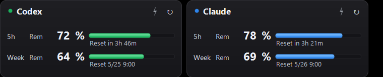
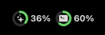
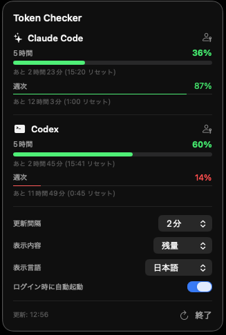

[\[English\]](./README.md) [\[日本語\]](./README.ja.md)

# Token Checker 修正版 (fork)

macOS のメニューバーに Claude Code と Codex の使用率を常時表示する macOS アプリケーションです。

このリポジトリは [otoha1119/token-checker](https://github.com/otoha1119/token-checker) を元にした個人用フォークです。オリジナル版の設計と実装をベースに、npm/nvm 版 Codex CLI での起動安定化、メニューバー表示の視認性改善、週次ウィンドウ表示の強化を加えています。

## Windows向けアプリ

Windows 向けには [Headroom](https://github.com/tesuheee/headroom-ai-usage-monitor) も公開しています。Claude Code と Codex のクォータ、リセット時刻、OAuth ログイン状態、レート制限を確認するためのデスクトップAI使用量モニターです。

<p align="center">
  <a href="https://github.com/tesuheee/headroom-ai-usage-monitor">
    
  </a>
</p>

## このフォークで追加した変更

- npm/nvm 経由でインストールした Codex CLI でも `codex app-server` を起動しやすいよう、stdio 起動を優先し、`codex` と同じディレクトリを子プロセスの `PATH` に追加。
- Codex RPC が `error` を返した場合、`missing result` ではなく実際のエラー内容を表示。
- macOS のダークなメニューバー上でパーセンテージ文字が黒く潰れないよう、メニューバー画像生成時の color scheme を明示。
- 週次ウィンドウにもバーを表示。5 時間ウィンドウを主指標として太く、週次ウィンドウを補助指標として細く表示。
- 使用量 (0% → 100%) と残量 (100% → 0%) の表示を切り替える設定を追加。

<p align="center">
  
  <br/>
  
</p>

## 概要

ターミナルで `claude login` / `codex login` を完了済みのアカウントに対し、Anthropic の OAuth エンドポイントおよび `codex app-server` の JSON-RPC を経由してレート制限情報を取得します。取得結果はメニューバーに 2 個のドーナツチャートと数値で表示され、クリックでポップオーバーに 5 時間ウィンドウと週次ウィンドウの詳細を展開します。

## 動作要件

| 項目 | 値 |
| --- | --- |
| macOS | 14 Sonoma 以上 |
| Swift | 5.9 以上（Xcode Command Line Tools で可） |
| Claude Code CLI | `claude login` 済み |
| Codex CLI | `codex login` 済み |

Claude Code と Codex のいずれかが欠けていても、もう一方は動作します。

## インストール

このリポジトリを clone した上で、自分のマシンでビルドして使うことを前提とします。

```bash
./Scripts/build.sh --install
```

ビルド時に Apple Development の署名 identity が見つからない場合は ad-hoc 署名が自動的に使われます。自分でビルドした `.app` はそのまま起動できます。

インストール後は Finder の「アプリケーション」から `TokenChecker` を開くか、ターミナルから以下を実行して起動します。

```bash
open /Applications/TokenChecker.app
```

## 使用方法

事前にターミナルで以下を実行し、両サービスにログインしておきます。

```bash
claude login
codex login
```

いずれもブラウザの OAuth フローを経て、Keychain または `~/.codex/auth.json` にトークンが保存されます。アプリは保存されたトークンを参照するため、ログインは CLI 側で 1 度行えば十分です。

ポップオーバーには、5 時間ウィンドウと週次ウィンドウの使用率または残量、リセットまでの残時間、更新間隔、表示内容（使用量 / 残量）、ログイン時の自動起動トグルが含まれます。

## データ取得経路

- **Claude**: `/usr/bin/security` 経由で Keychain (`Claude Code-credentials`) から OAuth アクセストークンを取得し、`https://api.anthropic.com/api/oauth/usage` に対して `anthropic-beta: oauth-2025-04-20` ヘッダー付きで GET します。
- **Codex**: `codex` バイナリを子プロセスとして起動し、行区切り JSON-RPC 経由で `account/rateLimits/read` を呼びます。バイナリの場所は主要なインストール先を順に探索し、見つからない場合はログインシェル経由で `command -v codex` を解決します。`UserDefaults` の `codexPath` キーで手動指定も可能です: `defaults write com.token-checker.app codexPath /abs/path/codex`

起動コマンドは `codex app-server` 単体形式を先に試し、必要な場合だけ `codex app-server daemon start` + `codex app-server proxy` 形式へフォールバックします。npm/nvm 版の `codex` が `env node` 経由で動く場合に備え、解決した `codex` と同じディレクトリを子プロセスの `PATH` に追加します。

## アップデート

最新のソースを取得して再ビルドします。

```bash
git pull
./Scripts/build.sh --install
```

既存のアプリは自動的に上書きされます。ポーリング間隔、表示内容、ログイン時の自動起動などの設定は UserDefaults に保存されているため引き継がれます。アプリが既に起動中の場合はメニューバーの「終了」で一度落としてから再度開いてください。

## アンインストール

```bash
killall TokenChecker
defaults delete com.token-checker.app 2>/dev/null
```

## ライセンス

本ソフトウェアは [MIT License](./LICENSE) で配布されます。

「Anthropic」「Claude」「Codex」は各社の商標であり、本ソフトウェアは Anthropic および OpenAI の公式プロダクトではなく、両社による承認・推奨を受けたものでもありません。

## 免責事項

本ソフトウェアは現状有姿 (as-is) で提供されるものであり、動作・安全性・正確性について保証しません。利用者自身の責任において使用してください。

## 謝辞

このフォークは [otoha1119/token-checker](https://github.com/otoha1119/token-checker) を元にしています。オリジナル版の作者とコントリビューターに感謝します。

UI のデザインは [s-age/ccmeter](https://github.com/s-age/ccmeter)（MIT License）を参考にしています。MIT ライセンスは [`LICENSE`](./LICENSE) に同梱しています。
